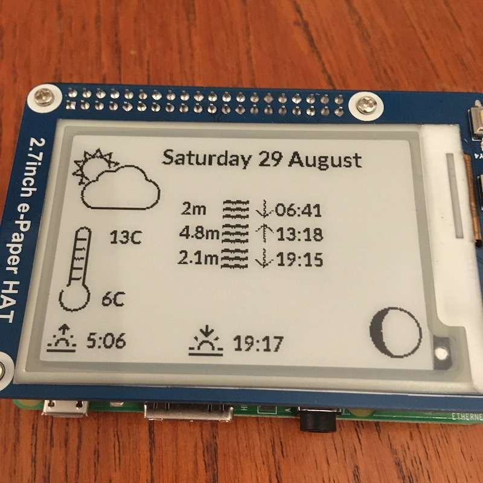

# RaspberryPi weather station

This was a little project putting together a weathers station using some off-the-shelf hardware, a little R and Python. I've written-up some details here in case they are of use to anyone else.

I wanted to have a wee screen with weather, tides, moon phase, date and sunrise/sunset times on it. Having a 1.4GHz 64-bit quad-core processor is very much overkill for this task!

# General plan

The developers of the screen have Python code available to update the display. The problem is I don't know Python. So the plan is to use `reticulate` to interface R (which I do know) with Python code. Python does the display, R does the data processing.

# Materials and methods

## Hardware
- [RaspberryPi 3B+](https://www.raspberrypi.org/products/raspberry-pi-3-model-b-plus/)
- [WaveShare 2.7inch e-Paper HAT](https://www.waveshare.com/wiki/2.7inch_e-Paper_HAT)

Some additional information on the display, from the manufacturer:

- [WaveShare example code](https://github.com/waveshare/e-Paper/blob/master/RaspberryPi%26JetsonNano/python/examples/epd_2in7_test.py)
- [More WaveShare example code](https://github.com/soonuse/epd-library-python/blob/master/2.7inch_e-paper/raspberrypi/python/main.py0)

## Data

Some data needs to come from external sources, so this required a bit of faff...

### Tides

Data is available [from UK Hydrographic Office](https://www.admiralty.co.uk/digital-services/data-solutions/uk-tidal-api) but (1) it's only for a point fairly far from where I care about and (2) you can only use their API for free for one year. So instead I scraped the [Met Office](https://www.metoffice.gov.uk/) beach forecast page.

### Weather and temperature

[Metcheck](https://www.metcheck.com/) have a free [JSON feed](https://www.metcheck.com/OTHER/json_data.asp) which is easy to parse. They also provide a summary icon description, which I related to icons from [OpenMoji](https://openmoji.org/).

### Sunrise/sunset

Sunrise and sunset data also comes from Metcheck.

### Moon phase

The R package [`lunar`](https://CRAN.R-project.org/package=lunar) provides moon phases in 8 phases, which I displayed using icons from [Icon Bolt](https://www.iconbolt.com/).

# Putting it all together

`update_screen.R` runs the show and calls the other scripts. This involves sourcing and parsing weather data (`metcheck.R`), and scraping the tide data (`tides.R`). The data then gets sent to Python (`update_rot.py`) which talks to the screen.

`reticulate` made this all really easy, as you can just source Python files and run the functions as if they were R functions.

What was fiddly was updating the screen, moving things around and using the Python Image Library to convert images to be greyscale to show-up on the screen.

# Resources

- [Rane Wallin's tutorial](https://dev.to/ranewallin/getting-started-with-the-waveshare-2-7-epaper-hat-on-raspberry-pi-41m8)
- [Code from Rane Wallin's tutorial](https://gist.github.com/RaneWallin/3d8645d06aed9251eed8c9079314807f)
- [`reticulate`](https://rstudio.github.io/reticulate/) for running Python within R

